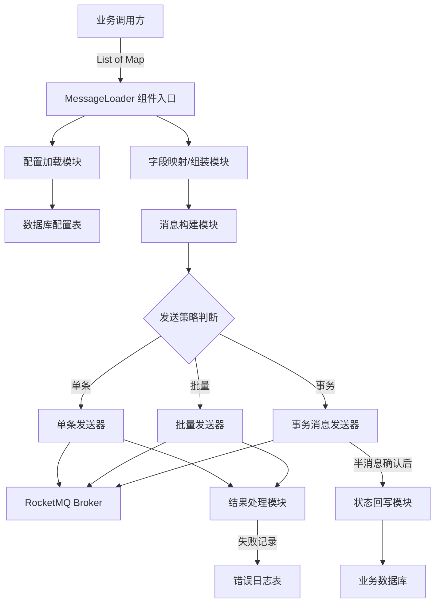
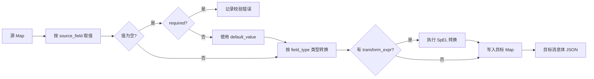
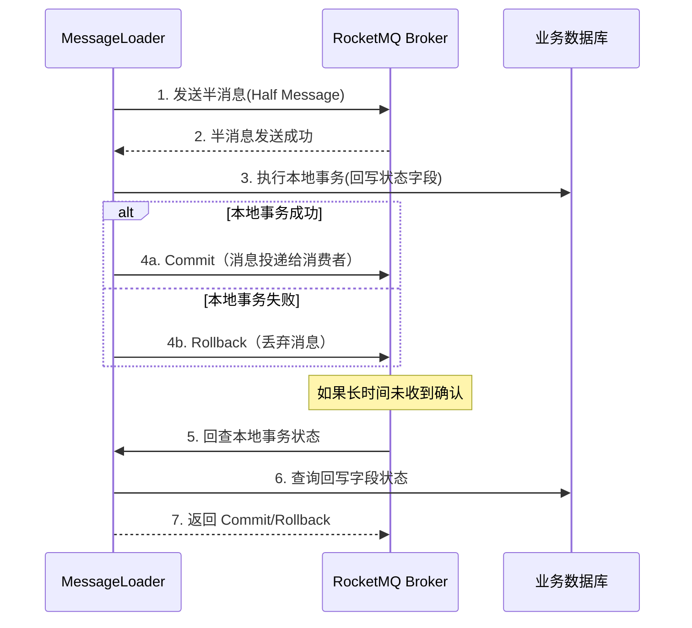

# RocketMQ 可配置消息加载组件 - 详细设计方案

## 一、概述

设计一个通用的消息加载组件（MessageLoader），核心职责是：

- 接收 `List<Map<String, Object>>` 格式的内存数据
- 根据数据库中存储的配置规则，提取/映射字段，组装成目标消息结构体
- 发送到指定的 RocketMQ Topic
- 支持单条发送和批量发送两种模式
- 支持事务消息，发送成功后回写源表状态字段

---

## 二、整体架构




---

## 三、数据库配置表设计

### 3.1 主配置表：`msg_loader_config`


| 字段                        | 类型           | 说明                                      |
| ------------------------- | ------------ | --------------------------------------- |
| id                        | BIGINT       | 主键                                      |
| config_code               | VARCHAR(64)  | 配置编码，唯一标识，调用方传入此编码                      |
| config_name               | VARCHAR(128) | 配置名称（便于管理）                              |
| topic                     | VARCHAR(128) | 目标 RocketMQ Topic                       |
| tag                       | VARCHAR(128) | 消息 Tag（可选，为空则不设置）                       |
| send_mode                 | VARCHAR(16)  | 发送模式：`SINGLE` / `BATCH` / `TRANSACTION` |
| batch_size                | INT          | 批量发送时每批大小，默认 200（仅 BATCH 模式有效）          |
| message_key_field         | VARCHAR(64)  | 从数据中取哪个字段作为消息的 Key（用于消息检索，可选）           |
| enable_transaction        | TINYINT(1)   | 是否启用事务消息：0-否 1-是                        |
| writeback_table           | VARCHAR(128) | 事务回写目标表名（事务模式下必填）                       |
| writeback_status_field    | VARCHAR(64)  | 回写的状态字段名                                |
| writeback_status_value    | VARCHAR(64)  | 发送成功时回写的值（如 "SENT"）                     |
| writeback_condition_field | VARCHAR(64)  | 回写条件字段（通常是主键字段名）                        |
| status                    | TINYINT(1)   | 配置状态：0-禁用 1-启用                          |
| created_at                | DATETIME     | 创建时间                                    |
| updated_at                | DATETIME     | 更新时间                                    |


### 3.2 字段映射表：`msg_loader_field_mapping`


| 字段             | 类型           | 说明                                                             |
| -------------- | ------------ | -------------------------------------------------------------- |
| id             | BIGINT       | 主键                                                             |
| config_id      | BIGINT       | 关联主配置 ID                                                       |
| source_field   | VARCHAR(128) | 源字段名（对应 Map 中的 Key）                                            |
| target_field   | VARCHAR(128) | 目标字段名（消息结构体中的 Key）                                             |
| field_type     | VARCHAR(32)  | 字段类型：`STRING` / `INT` / `LONG` / `DOUBLE` / `BOOLEAN` / `DATE` |
| default_value  | VARCHAR(256) | 默认值（源字段为空时使用，可选）                                               |
| required       | TINYINT(1)   | 是否必填：0-否 1-是                                                   |
| transform_expr | VARCHAR(512) | 转换表达式（可选，如日期格式化、SpEL 表达式等）                                     |
| sort_order     | INT          | 字段排序                                                           |


---

## 四、核心模块设计

### 4.1 组件入口 - MessageLoaderService

组件对外暴露的核心接口：

```java
public interface MessageLoaderService {

    /**
     * 加载并发送消息
     * @param configCode 配置编码
     * @param dataList   数据列表 List<Map<String, Object>>
     * @return 发送结果
     */
    LoadResult load(String configCode, List<Map<String, Object>> dataList);
}
```

返回结果结构：

```java
public class LoadResult {
    private boolean success;        // 整体是否成功
    private int totalCount;         // 总条数
    private int successCount;       // 成功条数
    private int failCount;          // 失败条数
    private List<FailRecord> failRecords;  // 失败明细
}

public class FailRecord {
    private int index;              // 原数据中的索引位置
    private Map<String, Object> data;  // 原始数据
    private String errorMsg;        // 失败原因
}
```

### 4.2 配置加载模块 - ConfigLoader

- 根据 `configCode` 从数据库加载主配置 + 字段映射列表
- 引入本地缓存（如 Caffeine），避免每次调用都查库
- 缓存失效策略：TTL（建议 5 分钟）+ 手动刷新接口

```java
public class LoaderConfig {
    private MsgLoaderConfig mainConfig;
    private List<MsgLoaderFieldMapping> fieldMappings;
}
```

### 4.3 字段映射/组装模块 - FieldMapper

职责：将一条 `Map<String, Object>` 按照字段映射规则转换成目标消息结构体。

处理逻辑：

1. 遍历字段映射列表
2. 从源 Map 中按 `source_field` 取值
3. 如果值为空，检查 `required`，必填则记录错误；非必填则使用 `default_value`
4. 按 `field_type` 做类型转换
5. 如果配置了 `transform_expr`，执行转换（SpEL 表达式）
6. 以 `target_field` 为 Key 写入目标 Map
7. 最终将目标 Map 序列化为 JSON 作为消息体




### 4.4 发送策略模块

#### 4.4.1 单条发送（SINGLE）

- 逐条发送，每条独立处理
- 适用于数据量小、对实时性要求高的场景
- 每条发送后独立记录结果

#### 4.4.2 批量发送（BATCH）

- 按 `batch_size` 分批发送
- 注意 RocketMQ 批量消息限制：
  - 同一批次必须是同一个 Topic
  - 同一批次不能是延迟消息
  - 单批次消息总大小不超过 4MB（建议内部做大小检测，超限自动拆分）
- 批次内某条失败不影响其他批次

#### 4.4.3 事务消息（TRANSACTION）

使用 RocketMQ 事务消息机制：




事务消息的本地事务逻辑：

- 根据 `writeback_table` + `writeback_status_field` + `writeback_condition_field` 构建 UPDATE SQL
- 将 `writeback_status_value` 写入目标字段
- 回查时查询该字段是否已更新为目标值

### 4.5 结果处理与容错

容错策略：**跳过并记录日志**

- 单条/批量模式：发送失败的记录跳过，记入 `LoadResult.failRecords`
- 同时写入错误日志表 `msg_loader_error_log`
- 不中断整体流程，保证其他数据正常发送

错误日志表 `msg_loader_error_log`：


| 字段           | 类型            | 说明        |
| ------------ | ------------- | --------- |
| id           | BIGINT        | 主键        |
| config_code  | VARCHAR(64)   | 配置编码      |
| topic        | VARCHAR(128)  | 目标 Topic  |
| message_body | TEXT          | 消息内容      |
| error_msg    | VARCHAR(1024) | 错误信息      |
| data_index   | INT           | 原数据索引位置   |
| raw_data     | TEXT          | 原始数据 JSON |
| created_at   | DATETIME      | 发生时间      |


---

## 五、需要额外考虑的点（遗漏评估）

以下是你原始诉求之外，建议补充考虑的方面：

### 5.1 消息幂等性

- 建议在消息体中包含一个业务唯一标识（通过 `message_key_field` 配置）
- 消费端可据此做幂等去重
- 发送端可基于此标识避免重复发送（如果数据带有唯一ID）

### 5.2 消息体大小控制

- RocketMQ 默认单条消息上限 4MB
- 批量模式下需要累加计算大小，超限自动拆分子批次
- 建议在字段映射时就做大字段检测告警

### 5.3 配置校验

- 加载配置后需要做完整性校验（Topic 非空、字段映射至少一条、事务模式下回写配置必填等）
- 校验失败快速失败，避免运行时出错

### 5.4 监控与可观测性

- 关键指标：发送 TPS、成功率、平均延迟、失败率
- 建议埋点：每次 load 调用记录 configCode、数据量、耗时、成功/失败数
- 可对接公司现有监控体系（Prometheus/Grafana 或内部监控）

### 5.5 并发与线程安全

- 组件可能被多个线程并发调用
- 配置缓存需线程安全
- RocketMQ Producer 实例需合理复用（不要每次调用都创建）

### 5.6 数据脱敏/过滤

- 是否需要对敏感字段做脱敏后再发送
- 是否需要按条件过滤掉不符合要求的数据行（如某个字段为空则跳过）

### 5.7 消息顺序性

- 当前设计默认无序发送
- 如果业务需要顺序消费，需要配置 MessageQueueSelector，按业务 Key 路由到同一个 Queue

---

## 六、调用示例（伪代码）

```java
// 业务方调用
List<Map<String, Object>> dataList = queryFromSomewhere();

LoadResult result = messageLoaderService.load("ORDER_SYNC_CONFIG", dataList);

if (!result.isSuccess()) {
    log.warn("部分数据发送失败: 总数={}, 成功={}, 失败={}",
        result.getTotalCount(),
        result.getSuccessCount(),
        result.getFailCount());
    // 失败明细已自动记录到 error_log 表
}
```

---

## 七、总结


| 能力       | 设计方案                                                    |
| -------- | ------------------------------------------------------- |
| 字段配置     | 数据库表 `msg_loader_field_mapping`，支持字段映射、类型转换、默认值、SpEL表达式 |
| Topic 配置 | 数据库表 `msg_loader_config`，支持 Topic + Tag                 |
| 单条发送     | `SINGLE` 模式，逐条发送独立处理                                    |
| 批量发送     | `BATCH` 模式，按 batch_size 分批，自动大小检测                       |
| 事务消息     | `TRANSACTION` 模式，半消息 + 本地事务回写 + 回查机制                    |
| 状态回写     | 配置回写表/字段/值，事务提交时执行 UPDATE                               |
| 容错       | 跳过失败记录，写入错误日志表，不中断整体流程                                  |


